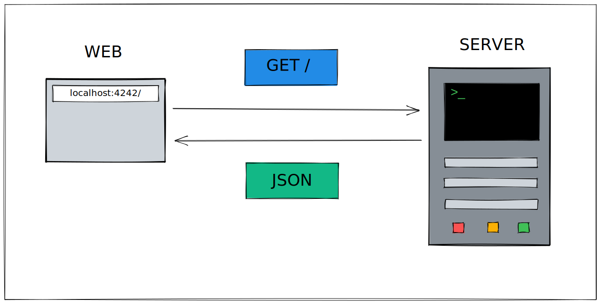

# 42 labs - API



### This project was developed for the 42 labs selective process

## Usage

### Requirements

This project requires *gcc* compiler.

### Instructions

In the repository's directory, run `make`

```sh
make 
```

> `make` suports 4 flags: 
> - `make all` or simply `make` compiles the project
> - `make clean` deletes the `.o` files generated during compilation
> - `make fclean` deletes the `.o` and the executable file
> - `make re` executes `fclean` and `all` in sequence

After this you can run the executable file:

```sh
./api42labs
```

To end the program you can use `ctrl+c` in your terminal.